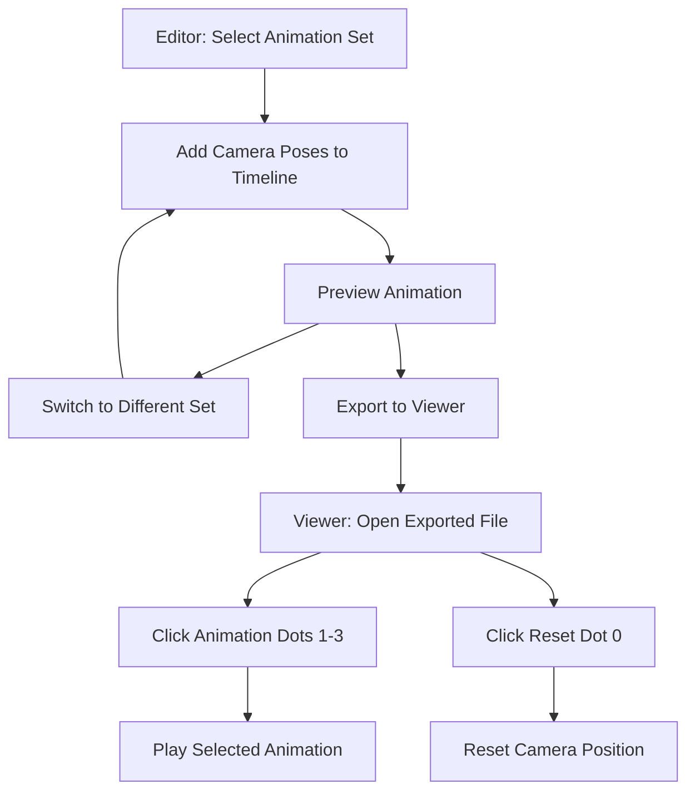

## 1. Product Overview
Extending SuperSplat's timeline functionality to support multiple camera animation sets and adding animation control dots in the viewer application for easy animation switching.

## 2. Core Features

### 2.1 User Roles
| Role | Registration Method | Core Permissions |
|------|---------------------|------------------|
| Editor User | Standard application access | Can create and edit multiple animation sets, export to viewer |
| Viewer User | No registration (uses exported HTML/ZIP) | Can view 3D content and switch between animations |

### 2.2 Feature Module
Our SuperSplat enhancement requirements consist of the following main pages:
1. **Editor Interface**: timeline panel with animation set selector, camera pose controls.
2. **Export Dialog**: enhanced export options for multiple animation sets.
3. **Viewer Application**: 3D viewer with animation control dots for switching between animations.

### 2.3 Page Details
| Page Name | Module Name | Feature description |
|-----------|-------------|---------------------|
| Editor Interface | Animation Set Selector | Add dropdown menu above timeline to select between 3 animation sets (1-3). Each set maintains independent camera poses and timeline data. |
| Editor Interface | Timeline Panel | Display and edit camera keyframes for the currently selected animation set. Update timeline visualization when switching between sets. |
| Editor Interface | Camera Controls | Add, modify, and delete camera poses within the currently selected animation set. |
| Export Dialog | Animation Export Options | Include all animation sets in the exported viewer application. Configure animation playback settings. |
| Viewer Application | Animation Control Dots | Display 4 white dots (0-3) on the right side of the screen. Dot 0 resets camera to initial position. Dots 1-3 trigger respective animation sets. |
| Viewer Application | Animation Playback | Play selected animation set with proper camera movement along the defined path. Support looping and one-time playback options. |

## 3. Core Process

### Editor Animation Creation Flow
1. User selects an animation set (1-3) from the dropdown in the timeline panel
2. User positions the camera and adds keyframes to the timeline
3. User can preview the animation by playing it in the editor
4. User can switch to another animation set and create different camera movements
5. User exports the scene with all animation sets to HTML or ZIP format

### Viewer Animation Playback Flow
1. User opens the exported viewer in a browser
2. User can click on dots 1-3 on the right side to trigger different animations
3. User can click on dot 0 to reset the camera to its initial position
4. Animations play according to the settings defined during export

## 4. User Interface Design

### 4.1 Design Style
- Primary colors: White (#FFFFFF), Dark Gray (#333333), Blue Accent (#007ACC)
- Secondary colors: Light Gray (#CCCCCC), Medium Gray (#666666)
- Button style: Minimal, rounded corners (4px radius)
- Font: System UI font, sizes 12px (labels), 14px (content), 16px (headers)
- Layout style: Dark theme with light text, compact controls
- Icons: Simple, monochrome SVG icons with consistent 24x24px size

### 4.2 Page Design Overview

| Page Name | Module Name | UI Elements |
|-----------|-------------|-------------|
| Editor Interface | Animation Set Selector | Dropdown menu with 3 options ("Animation Set 1", "Animation Set 2", "Animation Set 3"), positioned above timeline panel. Background: Dark Gray (#333333), Text: White (#FFFFFF), Accent: Blue (#007ACC). |
| Editor Interface | Timeline Panel | Timeline with keyframe markers showing only the currently selected animation set. Active set's keyframes highlighted in blue. |
| Viewer Application | Animation Control Dots | 4 white circular dots (12px diameter) vertically aligned on right side of screen, 15px spacing between dots. Dot 0 has reset icon, dots 1-3 have numbers. Active dot highlighted with blue border. |

### 4.3 Responsiveness
The editor interface is desktop-first with minimal responsiveness for larger screens. The viewer application is fully responsive with touch interaction optimization for mobile devices, ensuring animation control dots are easily tappable on touch screens (minimum 44px touch target area).