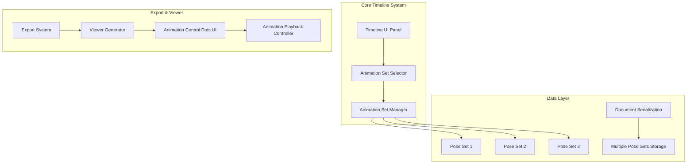

# SuperSplat Multiple Animation Sets - Technical Architecture Document

## 1. Architecture Design



## 2. Technology Description

- Frontend: TypeScript + PlayCanvas Engine
- UI Framework: PCUI (PlayCanvas UI)
- Animation System: Cubic Spline Interpolation
- Export Formats: HTML/ZIP with embedded viewer
- Data Storage: JSON serialization with pose sets

## 3. Core Implementation Plan

### 3.1 Data Structure Changes

**Current Structure:**
```typescript
// Single pose array
const poses: Pose[] = [];
```

**New Structure:**
```typescript
// Multiple pose sets
interface PoseSet {
    id: number;
    name: string;
    poses: Pose[];
    active: boolean;
}

const poseSets: PoseSet[] = [
    { id: 1, name: 'Animation Set 1', poses: [], active: true },
    { id: 2, name: 'Animation Set 2', poses: [], active: false },
    { id: 3, name: 'Animation Set 3', poses: [], active: false }
];
```

### 3.2 File Modifications Required

| File Path | Modification Type | Description |
|-----------|-------------------|-------------|
| `src/camera-poses.ts` | Major Refactor | Convert single pose array to multiple pose sets with set management |
| `src/ui/timeline-panel.ts` | UI Enhancement | Add dropdown selector for animation sets |
| `src/timeline.ts` | Logic Update | Support set-specific timeline operations |
| `submodules/supersplat-viewer/src/index.html` | UI Addition | Add 4 animation control dots on right side |
| `submodules/supersplat-viewer/src/viewer.js` | Feature Addition | Implement animation set switching and playback |
| `submodules/supersplat-viewer/src/index.css` | Styling | Style animation control dots |
| `src/ui/export-popup.ts` | Export Logic | Update export to include all animation sets |
| `src/splat-serialize.ts` | Serialization | Modify to handle multiple animation tracks |

## 4. UI Design Specifications

### 4.1 Timeline Panel Enhancement

**Animation Set Selector:**
- Position: Top of timeline panel, above play controls
- Component: Dropdown select input
- Options: "Animation Set 1", "Animation Set 2", "Animation Set 3"
- Behavior: Switching sets loads different pose data and rebuilds timeline

**Visual Design:**
```css
.animation-set-selector {
    margin-bottom: 10px;
    padding: 5px;
    background: rgba(0, 0, 0, 0.7);
    border-radius: 4px;
}
```

### 4.2 Viewer Animation Control Dots

**Position & Layout:**
- Location: Right side of viewer screen
- Vertical alignment: Center
- Spacing: 15px between dots
- Size: 12px diameter circles

**Dot States:**
- Dot 0: Reset camera (white with reset icon)
- Dots 1-3: Animation triggers (white, numbered)
- Active state: Highlighted with blue border
- Hover state: Slight scale increase (1.1x)

**CSS Implementation:**
```css
.animation-dots {
    position: fixed;
    right: 20px;
    top: 50%;
    transform: translateY(-50%);
    display: flex;
    flex-direction: column;
    gap: 15px;
    z-index: 1000;
}

.animation-dot {
    width: 12px;
    height: 12px;
    border-radius: 50%;
    background: white;
    border: 2px solid rgba(255, 255, 255, 0.8);
    cursor: pointer;
    transition: all 0.2s ease;
    display: flex;
    align-items: center;
    justify-content: center;
    font-size: 8px;
    font-weight: bold;
    color: #333;
}

.animation-dot:hover {
    transform: scale(1.1);
    border-color: #007acc;
}

.animation-dot.active {
    border-color: #007acc;
    box-shadow: 0 0 8px rgba(0, 122, 204, 0.5);
}
```

## 5. Core API Definitions

### 5.1 Animation Set Management API

```typescript
// Get current active animation set
GET /api/animation/current-set
Response: { setId: number, name: string }

// Switch to different animation set
POST /api/animation/switch-set
Request: { setId: number }
Response: { success: boolean, poses: Pose[] }

// Add pose to specific set
POST /api/animation/add-pose
Request: { setId: number, pose: Pose }
Response: { success: boolean }

// Get all animation sets
GET /api/animation/sets
Response: { sets: PoseSet[] }
```

### 5.2 Viewer Control API

```typescript
// Trigger animation playback
POST /api/viewer/play-animation
Request: { setId: number }
Response: { success: boolean, duration: number }

// Reset camera to initial position
POST /api/viewer/reset-camera
Response: { success: boolean }

// Get animation status
GET /api/viewer/animation-status
Response: { playing: boolean, currentSet: number, progress: number }
```

## 6. Data Model Updates

### 6.1 Document Serialization Schema

**Current Format:**
```json
{
  "poseSets": [
    {
      "name": "set0",
      "poses": [...]
    }
  ]
}
```

**New Format:**
```json
{
  "poseSets": [
    {
      "id": 1,
      "name": "Animation Set 1", 
      "poses": [...],
      "active": true
    },
    {
      "id": 2,
      "name": "Animation Set 2",
      "poses": [...], 
      "active": false
    },
    {
      "id": 3,
      "name": "Animation Set 3",
      "poses": [...],
      "active": false
    }
  ],
  "activeSetId": 1
}
```

### 6.2 Pose Data Structure

```typescript
interface Pose {
    name: string;
    frame: number;
    position: Vec3;
    target: Vec3;
    setId?: number; // New field to associate with animation set
}

interface AnimationTrack {
    setId: number;
    name: string;
    duration: number;
    frameRate: number;
    loopMode: 'none' | 'repeat' | 'pingpong';
    keyframes: {
        times: number[];
        values: {
            position: number[];
            target: number[];
        };
    };
}
```

## 7. Implementation Phases

### Phase 1: Core Data Structure (Week 1)
- Modify `camera-poses.ts` to support multiple pose sets
- Update document serialization/deserialization
- Implement animation set manager

### Phase 2: Timeline UI Enhancement (Week 2) 
- Add animation set selector to timeline panel
- Implement set switching logic
- Update timeline rebuild functionality

### Phase 3: Export System Updates (Week 3)
- Modify export popup to handle multiple animation sets
- Update viewer generation to include all sets
- Implement animation track serialization for viewer

### Phase 4: Viewer Animation Controls (Week 4)
- Add animation control dots to viewer UI
- Implement animation playback switching
- Add camera reset functionality
- Testing and refinement

## 8. Backward Compatibility

### 8.1 Migration Strategy
- Existing single pose set will be automatically converted to "Animation Set 1"
- Old document format will be detected and migrated on load
- Export maintains compatibility with existing viewer versions

### 8.2 Migration Code Example

```typescript
// In docDeserialize.poseSets
if (poseSets.length === 1 && !poseSets[0].id) {
    // Legacy format detected, migrate to new format
    const legacySet = poseSets[0];
    return [{
        id: 1,
        name: 'Animation Set 1',
        poses: legacySet.poses,
        active: true
    }];
}
```

## 9. Testing Strategy

### 9.1 Unit Tests
- Animation set switching logic
- Pose management for multiple sets
- Document serialization/deserialization

### 9.2 Integration Tests  
- Timeline UI with multiple sets
- Export functionality with all animation sets
- Viewer animation playback and controls

### 9.3 User Acceptance Tests
- Create 3 different camera animations
- Export and test viewer with animation dots
- Verify smooth switching between animation sets
- Test camera reset functionality

## 10. Performance Considerations

### 10.1 Memory Management
- Lazy loading of inactive animation sets
- Efficient spline caching for each set
- Cleanup of unused animation data

### 10.2 Rendering Optimization
- Only rebuild splines when active set changes
- Minimize DOM updates during set switching
- Optimize animation dot rendering in viewer

## 11. Future Enhancements

### 11.1 Advanced Features
- Animation set naming and customization
- Animation blending between sets
- Timeline synchronization across sets
- Animation set duplication and templates

### 11.2 UI Improvements
- Drag-and-drop pose management between sets
- Visual preview of animation paths
- Advanced timeline controls (speed, easing)
- Animation set thumbnails and previews